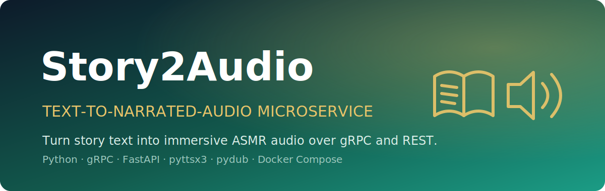

<p align="center">
  
</p>

<h1 align="center">Story2Audio Microservice</h1>

<p align="center"><em>Turn story text into immersive, narrated ASMR audio over gRPC and REST.</em></p>

<p align="center">
  
  
  
  
  
</p>

**Story2Audio** is a containerized text-to-audio microservice that generates atmospheric conspiracy stories with a **Mistral** LLM and narrates them as ASMR audio using **pyttsx3** and **pydub**. It exposes the same core service over a **gRPC** server and a **FastAPI** REST wrapper, with a **Streamlit** web UI on top — all orchestrated through **Docker Compose**.

> Text in, narrated audio out — one core service, reachable over gRPC, REST, or a browser.

---

## ✨ Features

- **Story generation** — atmospheric conspiracy stories on any topic via a local Mistral GGUF model.
- **ASMR audio narration** — converts story text to audio with pyttsx3, mixed with optional background music through pydub.
- **Voice customization** — tune speech `rate`, `volume`, `pitch`, voice index, and background-music toggle.
- **Three interfaces, one service** — gRPC server, REST API, and a Streamlit UI sharing the same backend.
- **Containerized** — a single image runs in `grpc`, `rest`, or `ui` mode via Docker Compose.

## 🏗️ Architecture

A single gRPC server holds the core logic; the REST API is a thin HTTP wrapper around it, and the Streamlit UI talks to the REST API.

```
                ┌─────────────────────┐
   Browser ───▶ │  Streamlit UI       │  :8501
                │  (app.py)           │
                └──────────┬──────────┘
                           │  HTTP (API_URL)
                ┌──────────▼──────────┐
   HTTP/cURL ─▶ │  REST API (FastAPI) │  :8000
                │  (rest_api.py)      │
                └──────────┬──────────┘
                           │  gRPC (GRPC_SERVER)
                ┌──────────▼──────────┐
   gRPC client▶ │  gRPC Server        │  :50051
   (asmr_       │  (asmr_server.py)   │
    client.py)  │   ├─ Mistral LLM    │  → story text
                │   └─ pyttsx3 + pydub│  → narrated audio
                └─────────────────────┘
```

**gRPC service (`asmr_service.proto`)** exposes three RPCs:

| RPC | Purpose |
| --- | --- |
| `GenerateStory` | Generate conspiracy story text from a topic. |
| `GenerateAudio` | Convert a story file into ASMR audio. |
| `GenerateStoryAndAudio` | Generate story text and audio in one call. |

**REST endpoints (`rest_api.py`):** `POST /api/generate-story`, `POST /api/generate-audio`, `POST /api/generate`, plus `GET /api/audio/{filename}` and `GET /api/story/{filename}`.

## 🚀 Run it

### With Docker Compose (recommended)

```bash
# 1. Place the Mistral model and background music
mkdir -p models/background_music
#   models/mistral-7b-instruct-v0.1.Q4_K_M.gguf
#   models/background_music/horror-background-atmosphere-11-240870.mp3

# 2. Build and start all three services
docker-compose build
docker-compose up -d

# Or start individual services
docker-compose up -d grpc-server   # gRPC  :50051
docker-compose up -d rest-api      # REST  :8000
docker-compose up -d ui            # UI    :8501

# View logs
docker-compose logs -f
```

Then open the UI at <http://localhost:8501>.

### Without Docker

```bash
python -m venv venv
source venv/bin/activate          # Windows: venv\Scripts\activate
pip install -r requirements.txt
python compile_proto.py           # generate gRPC stubs from the .proto

python asmr_server.py             # gRPC server  :50051
python rest_api.py                # REST API     :8000
streamlit run app.py              # Streamlit UI :8501
```

On Windows you can also use the helper script: `run_without_docker.bat all` (or `grpc` / `rest` / `ui`).

### Try the gRPC client

```bash
python asmr_client.py --action story --topic "ancient aliens"
python asmr_client.py --action audio --story-file "asmr_conspiracy_ancient_aliens.txt"
python asmr_client.py --action both  --topic "illuminati"
```

## 🔧 Configuration

Configured via environment variables:

| Variable | Default | Description |
| --- | --- | --- |
| `MISTRAL_MODEL_PATH` | `/app/models/mistral-7b-instruct-v0.1.Q4_K_M.gguf` | Path to the Mistral GGUF model file. |
| `BACKGROUND_MUSIC_PATH` | — | Path to the background music file (optional). |
| `GRPC_SERVER` | `localhost:50051` | Address of the gRPC server. |
| `API_URL` | `http://localhost:8000/api` | REST API base URL used by the UI. |

**Voice settings** (`VoiceSettings` in the proto): `rate` (speech speed), `volume` (`0.0`–`1.0`), and `pitch`, plus a `use_background_music` flag and `voice_index`.

## 🧪 Testing

```bash
python test_asmr_service.py
```

## 📦 Project structure

```
asmr_server.py        # gRPC service implementation
asmr_client.py        # Command-line gRPC client
asmr_service.proto    # Protocol buffer definitions
rest_api.py           # FastAPI REST wrapper around the gRPC service
app.py                # Streamlit UI
compile_proto.py      # Compiles the .proto into gRPC stubs
Dockerfile            # Single image, runs in grpc/rest/ui mode
docker-compose.yml    # Orchestrates the three services
deploy.sh             # Unix deployment helper
run_without_docker.bat# Windows non-Docker launcher
test_asmr_service.py  # Test suite
requirements.txt      # Python dependencies
```
